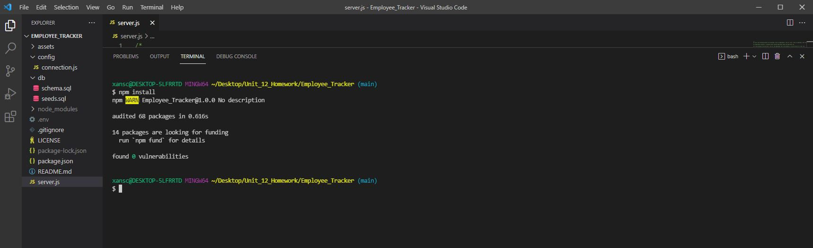
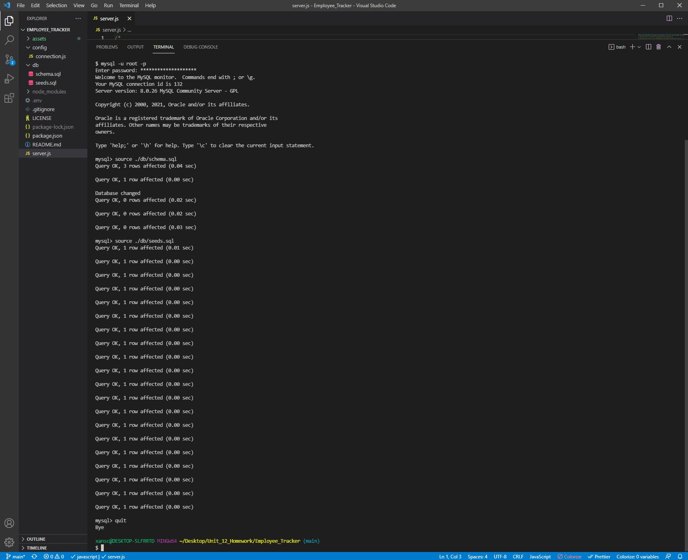

# Employee_Tracker

## Description

This is a command-line app that takes user input to display and manipulate simulated company databases for their departments, job roles, and employees. Databases are handled by MySQL. User input is handled by Inquirer. Execution occurs in Node.js.

## Table of Contents

1. [Description](#description)
2. [Installation](#installation)
3. [Usage](#usage)
4. [License](#license)

## Installation

First you need to fork, then clone, the repository to your local, and make sure you're ready to use Node.js, and MySQL. After doing so, open the integrated terminal in the Employee_Tracker directory and in the command line enter "npm install" to install the necessary dependancies. For this app, you will need to create a .env in the app root directory. The contents of that file will simply be: DB_PASSWORD=your_mysql_password. This concludes the installation and you are ready to use the app. Below is an image of the npm install.

## Usage

After installation is complete, in the integrated terminal enter "mysql -u root -p" to log in to MySQL. You will be prompted for your password. Then enter "source ./db/schema.sql", you should see queries and a database change. This will create the structure of the tables. Then enter "source ./db/seeds.sql" which will fill the tables with example values. Then you can "quit" which will exit the MySQL shell. After that, just enter "node server.js" and the app will run. The top level menu is comprised of a list of options to select from. Three of these will display each of the databases. Four of the options allow manipulation of the databases. The last option will exit the app. Below is an image of the .sql implementation and a video showing the entire process and full functionality of the app.

[Video of installation and usage.](https://drive.google.com/file/d/1dRSYXWdFgu17xengBgpbT1Iw1w_jJPRv/view)

## License

The license under which this project is covered is the MIT License. Learn more about that license [here](https://choosealicense.com/licenses/mit/).
